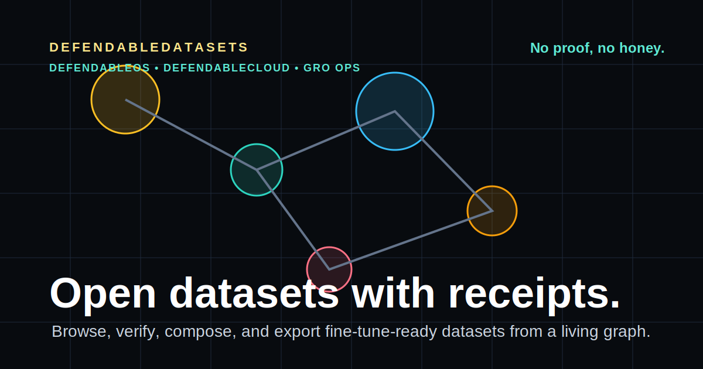

# DefendableDatasets

Open datasets with receipts.

Live: https://defendabledatasets.com



DefendableDatasets is the open-source dataset layer for the DefendableCloud / DefendableOS ecosystem. It is a static-first dataset registry, graph browser, selector, verifier, and export system for AI builders.

The v0 app lets users browse demo registry entries by domain, category, license, format, task type, quality score, and status; inspect dataset metadata; add datasets to a pack; and export client-side manifests.

Doctrine: No proof, no honey.

## Run Locally

```bash
npm install
npm run dev
```

Open `http://localhost:3000`.

## Screenshots

The public launch pages are static and live at:

- Homepage: https://defendabledatasets.com
- Graph: https://defendabledatasets.com/graph
- Registry: https://defendabledatasets.com/registry
- Minechain detail: https://defendabledatasets.com/datasets/minechain_master_inventory_v1

## Deploy to Cloudflare Pages

This app is configured for static export to Cloudflare Pages.

```bash
source ~/.nvm/nvm.sh
nvm use 22
npm run cf:build
npm run cf:deploy
```

The Cloudflare project name is `defendable-datasets`, and the static output directory is `out`.

Custom domain:

```text
defendabledatasets.com
```

After Cloudflare auth is configured, bind the domain in Cloudflare Pages to the `defendable-datasets` project and point DNS at the Pages target Cloudflare provides.

## Key Routes

- `/` homepage for defendabledatasets.com
- `/graph` living dataset graph
- `/app/graph` graph alias
- `/registry` dataset table view
- `/datasets/[id]` dataset detail pages
- `/pack` client-side pack builder and exports
- `/contribute` contributor workflow
- `/docs` schema, receipts, license policy, and roadmap

## Registry Data

Local registry files live in `/data/registry`:

- `datasets.json`
- `domains.json`
- `categories.json`
- `licenses.json`
- `formats.json`
- `tasks.json`
- `receipts.json`

Dataset asset packages live under `/datasets/[domain]/[dataset_id]` with:

- `dataset.card.md`
- `manifest.json`
- `samples/`
- `receipts/`
- `splits/`

The current seed entries are demo metadata unless real split files and matching receipts are added.

Some entries include `external_locations` pointing at the mounted Synology NAS:

```text
/mnt/swarm/swarm-and-bee-datasets
```

Those paths document where the real source assets live without committing large or compliance-sensitive files into git.

The Minechain master inventory is indexed from the NAS path:

```text
/volume1/minechain-data/master-inventory
```

That share is reachable over NAS SSH and may not be exposed through the `/mnt/swarm` NFS mount.

## CLI

Run registry checks and generate receipts before opening pull requests:

```bash
npm run registry:validate
npm run registry:hash -- datasets/general/minechain_master_inventory_v1/samples/sample.jsonl
npm run registry:pack -- minechain_master_inventory_v1 --out pack.manifest.json
```

Direct binary usage:

```bash
npx defendable-datasets validate
npx defendable-datasets hash <file...>
npx defendable-datasets pack <dataset-id...> [--out file.json]
```

## Add a Dataset

1. Add the metadata entry to `/data/registry/datasets.json`.
2. Create `datasets/[domain]/[dataset_id]/`.
3. Add `dataset.card.md`, `manifest.json`, sample rows, receipts, and split files where licensing permits.
4. Include SHA256 hashes for every file.
5. Add license compatibility expectations to `/data/registry/licenseCompatibility.json` if introducing a new license.
6. Run `npm run registry:validate`, `npm run lint`, and `npm run cf:build`.

Example package:

```text
datasets/general/minechain_master_inventory_v1/
  dataset.card.md
  manifest.json
  samples/sample.jsonl
  receipts/receipt.sha256.txt
  splits/README.md
```

## Export a Pack

Add datasets from the graph, registry, or detail page. Visit `/pack` and export:

- `pack.manifest.json`
- `hf_dataset_card.md`
- `fine_tune_manifest.json`
- `sha256_manifest.json`
- `README.md`

## Roadmap

- Real dataset file hosting
- Hugging Face sync
- S3/object storage backend
- DefendableCloud member access
- Dataset signing and Merkle proofs
- Dataset quality evaluator
- CLI validation and pack commands
- API access
- Fine-tune job handoff
- Model compatibility scoring
- Dataset lineage graph
- Dataset license compatibility checker

## Not Included Yet

- Public hosting of large real dataset split files
- Authenticated member access
- Backend API
- Hosted validation workers
- Automatic Hugging Face sync
- Signed Merkle proofs
- Clinical, legal, or financial deployment clearance

## Community Model

Free datasets for the community. Contributors should submit metadata, proof, hashes, license clarity, and small reviewable samples first. Large real data files should move to object storage once that backend lands.
